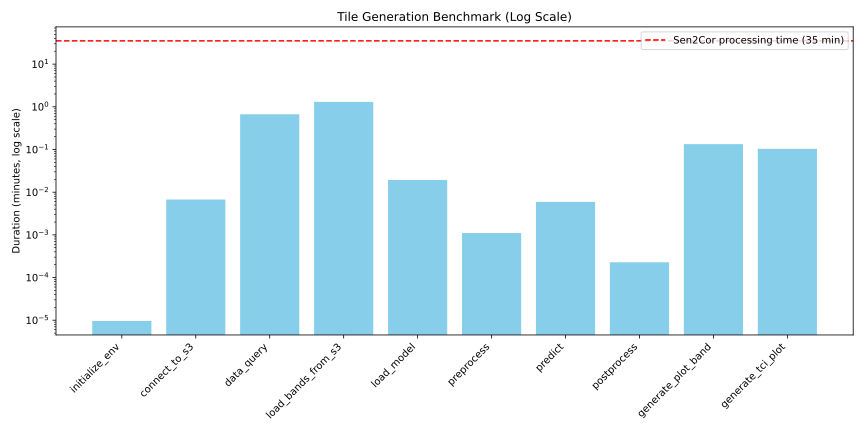

# DestinE_ESA_DeltaTwin

DestinE DeltaTwin workflow creation/run/publish for Sentinel2 L2A product generation with AI

## Table of Contents

1. [Run the Processor Locally](#1---run-the-processor-locally)
   1. [Installation](#installation)
   2. [Running the Processor](#running-the-processor)
2. [Run the Processor via Delta Twin and Publish](#2---run-the-processor-via-delta-twin-and-publish)
   1. [Set up CDSE Credentials](#set-up-cdse-credentials)
   2. [Test the Delta Twin Locally](#test-the-delta-twin-locally)
   3. [Publish the Delta Twin](#publish-the-delta-twin)
3. [Output Example](#output-example)
4. [Repository Structure](#repository-structure)

## 1 - Run the Processor Locally

### Installation

To run the processor locally, follow these steps:

1. **Clone the Repository**:

   ```bash
   git clone https://github.com/destination-earth/DestinE_ESA_DeltaTwin
   cd DestinE_ESA_DeltaTwin
   ```

2. **Create and Activate a Conda Environment**:

   ```bash
   conda create -n ai_processor python==3.12
   conda activate ai_processor
   ```

3. **Install the Required Dependencies**:

   ```bash
   pip install -r requirements.txt
   ```

   This will install all required dependencies including DeltaTwin platform packages (delta-core, deltatwin-cli), deep learning frameworks (PyTorch, segmentation-models-pytorch), and geospatial tools (pystac-client, boto3).

### Running the Processor

To run the processor, execute the following command:

```bash
cd ai-sen2cor-processor/models/src/
python main.py your_cdse_key your_cdse_secret
```

## 2 - Run the Processor via Delta Twin and Publish

### Set up CDSE Credentials

To set up your CDSE credentials, edit the `ai-sen2cor-processor/inputs_file.json` JSON file by adding your CDSE key and secret:

```json
{
  "cdse_key": {
    "type": "secret",
    "value": "your_cdse_key"
  },
  "cdse_secret": {
    "type": "secret",
    "value": "your_cdse_secret"
  }
}
```

### Test the Delta Twin Locally

#### GPU Prerequisites

Install libraries:

```bash
sudo apt-get install --no-install-recommends -y ca-certificates curl gcc gnupg2 software-properties-common wget
```

Download and install NVIDIA Cuda Toolkit. Please adapt following commands according the target system (<https://developer.nvidia.com/cuda-downloads>).

```bash
wget https://developer.download.nvidia.com/compute/cuda/repos/ubuntu2404/x86_64/cuda-keyring_1.1-1_all.deb
sudo dpkg -i cuda-keyring_1.1-1_all.deb
sudo apt-get update
sudo apt-get -y install cuda-toolkit-13-1
```

Install graphics-driver according your cuda version. See ([details](https://docs.nvidia.com/deploy/cuda-compatibility/forward-compatibility.html#id1))

```bash
sudo add-apt-repository ppa:graphics-drivers/ppa
sudo apt update
sudo apt upgrade
sudo apt-get install -y nvidia-driver-580
```

Install NVIDIA Container Toolkit (<https://docs.nvidia.com/datacenter/cloud-native/container-toolkit/latest/install-guide.html>)

```bash
curl -fsSL https://nvidia.github.io/libnvidia-container/gpgkey | sudo gpg --dearmor -o /usr/share/keyrings/nvidia-container-toolkit-keyring.gpg \
  && curl -s -L https://nvidia.github.io/libnvidia-container/stable/deb/nvidia-container-toolkit.list | \
    sed 's#deb https://#deb [signed-by=/usr/share/keyrings/nvidia-container-toolkit-keyring.gpg] https://#g' | \
    sudo tee /etc/apt/sources.list.d/nvidia-container-toolkit.list
sudo apt-get update
export NVIDIA_CONTAINER_TOOLKIT_VERSION=1.18.2-1
sudo apt-get install -y \
   nvidia-container-toolkit=${NVIDIA_CONTAINER_TOOLKIT_VERSION} \
   nvidia-container-toolkit-base=${NVIDIA_CONTAINER_TOOLKIT_VERSION} \
   libnvidia-container-tools=${NVIDIA_CONTAINER_TOOLKIT_VERSION} \
   libnvidia-container1=${NVIDIA_CONTAINER_TOOLKIT_VERSION}
```

Configure Docker

```bash
sudo nvidia-ctk runtime configure --runtime=docker
sudo systemctl restart docker
```

#### DeltaTwin local execution

To test the Delta Twin locally, run the following command:

```bash
deltatwin run start_local -i inputs_file.json
```

### Publish the Delta Twin

1. **Login to DeltaTwin**:

   ```bash
   deltatwin login username password --api https://api.deltatwin.destine.eu/
   ```

2. **Publish the Component**:

   ```bash
   deltatwin component publish -t AiSen2Cor -v private 0.1
   ```

## Workflow Output Example

Below is an example of the Delta Twin output. The L1C product download, preprocessed, ingested by the model to generate the L2A product from the same band. The worflow should output the following band:  B02, B03 and B04.




## Repository Structure

The repository is structured as follows:

```bash
├── LICENSE
├── README.md
├── ai-sen2cor-processor
│   ├── inputs_file.json
│   ├── manifest.json
│   ├── models
│   │   └── src
│   │       │   └── auth.py
│   │       ├── cfg
│   │       │   ├── config.yaml
│   │       │   └── query_config.yaml
│   │       ├── main.py
│   │       ├── model_zoo
│   │       │   └── models.py
│   │       ├── utils
│   │       │   ├── stac_client.py
│   │       │   ├── torch.py
│   │       │   └── utils.py
│   │       └── weight
│   │           └── AiSen2Cor_EfficientNet_b2.pth
│   └── workflow.yml
├── assets
│   ├── asset_TCI.png
│   ├── asset_b02.png
│   └── asset_benchmark_results.png
└── requirements.txt
```

This structure includes the main directories and files necessary for the DestinE DeltaTwin workflow creation for Sentinel2 L2A product generation with AI.
